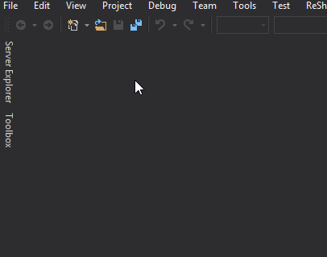

Unofficial Visual Studio 2015/2017 extension integrating Atlassian Jira.

## Features:
- Create new issue
- Edit issue
   - Summary
   - Description
   - Status
   - Priority
   - Add attachment
   - Create sub-task
   - Create linked issue
   - Assignee
   - Sprint
   - Labels
   - Time estimate
   - Create worklog (Log time, Time remaining, Date Started, Work description)
   - Fix versions
   - Affects versions
- View issue
   - By project
   - By favourite filter
- Search/Filter issues by
   - Sprint
   - Project
   - Priority
   - Status
   - Assigned to me
   - Unassigned
   - Text containing
- Quick search issues by
   - Text containing
   - key:issueKey
- Open issue in the browser

## How to open the Jira Panel

## How to authenticate (OAuth)
**As a prerequisity your Jira administrator must setup OAuth with JiraEX consumer [(how-to)](https://github.com/lubomyl/JiraEX/wiki/How-to-setup-OAuth-(Jira-administrator))**
1. After opening of the Jira panel type in your Jira application link (e.g. example.atlassian.net or example.net/jira) 
1. click **Authenticate**
1. Follow OAuth authentication steps to give the JiraEX extension permission
1. **Copy** generated code 
1. **Paste** in the Jira panel
1. click **Verify**

 

## How to authenticate (Basic)
1. After opening of the Jira panel type in your Jira application link (e.g. example.atlassian.net or example.net/jira) 
1. **Username** and **Password**
1. click **Authenticate**

## TODO
- **Working with Epics**
   - Create epic
   - Include an issue to an epic
   - List issues in an epic
   - Create an issue in an epic
- **Working with comments**
   - List issue comments history
   - Create comment for issue
- **Working with issue logs**
   - List issue logs history
   
## Dependencies
- DevDefined.OAuth 0.2
- Newtonsoft.Json 9.0.1
- RestSharp 106.3.1
